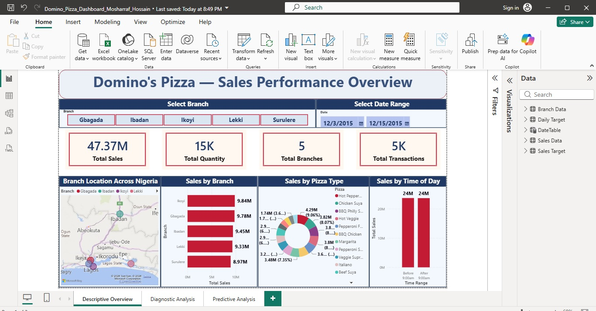
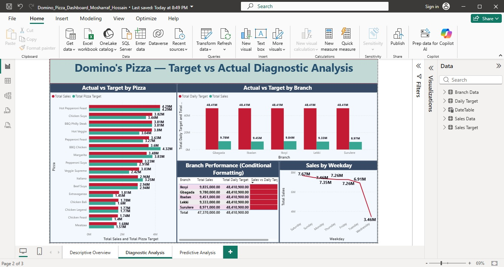
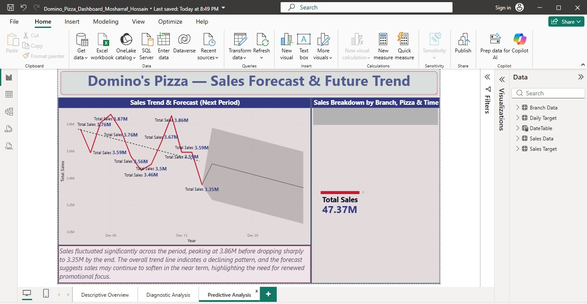

# Domino's Pizza Sales Performance Dashboard (Power BI)

## Overview
A Power BI dashboard analyzing two weeks of sales data across 5 Domino's 
Pizza branches in Nigeria, covering descriptive, diagnostic, and 
predictive analysis.

## Pages
1. **Descriptive Overview** – KPIs, branch/pizza/time-based sales breakdown
2. **Diagnostic Analysis** – Actual vs target comparison with conditional 
   formatting, weekday sales trend
3. **Predictive Analysis** – Sales trend and forecast for the upcoming period

## Key Insight
Ikoyi branch led in sales (9.84M), while overall daily targets were 
missed across all branches — highlighting an opportunity for targeted 
promotional strategies.

## Tools Used
Power BI Desktop, Power Query, DAX, Data Modeling

## Screenshots

## Files
- `Domino_Pizza_Dashboard.pbix` – Full Power BI file
- `Dashboard_Export.pdf` – PDF export of all pages# dominos-pizza-powerbi-dashboard
Power BI dashboard analyzing sales performance across Domino's Pizza branches in Nigeria
